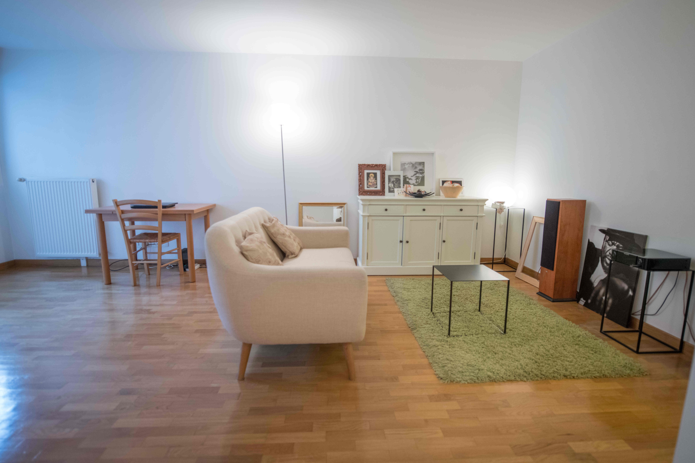
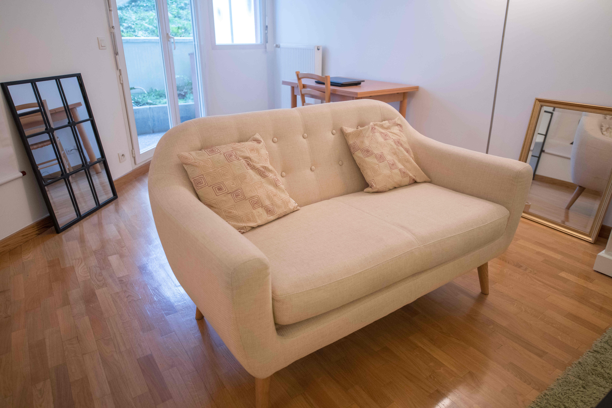
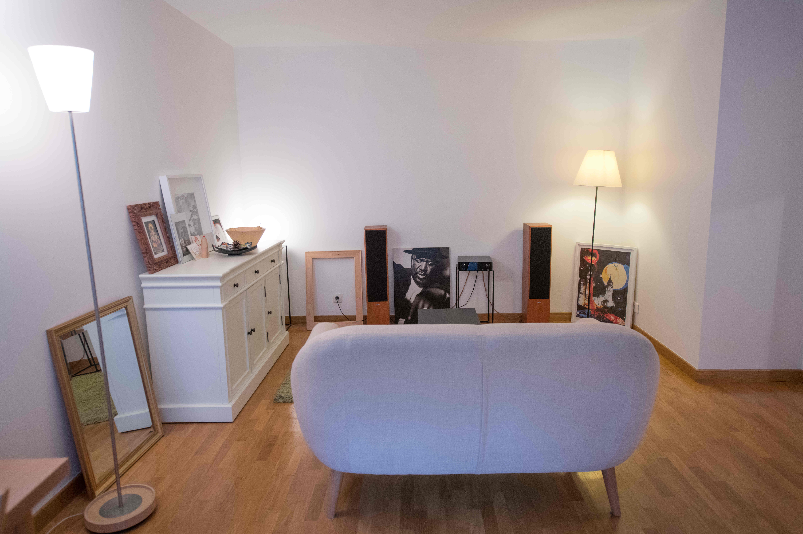
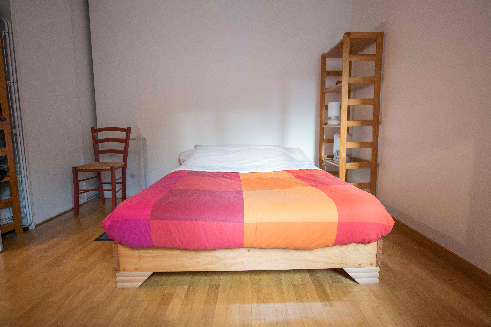
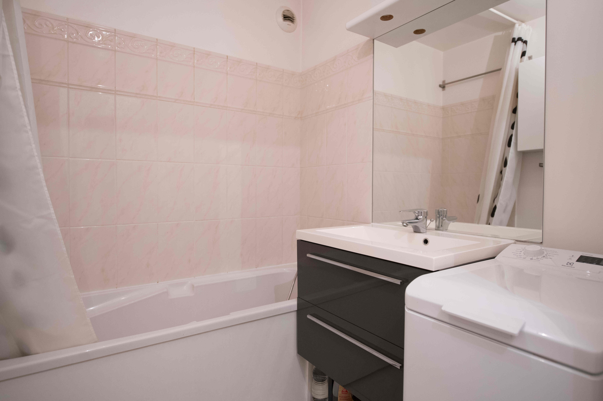
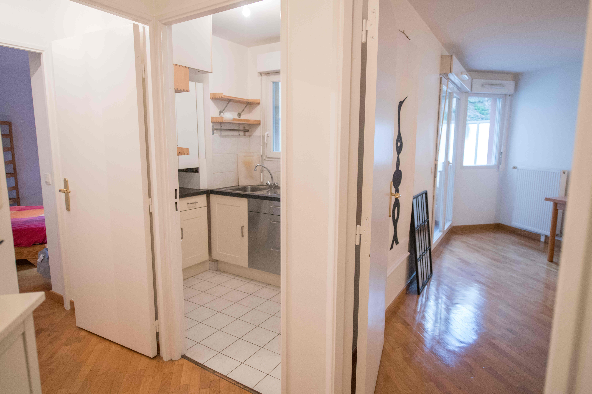
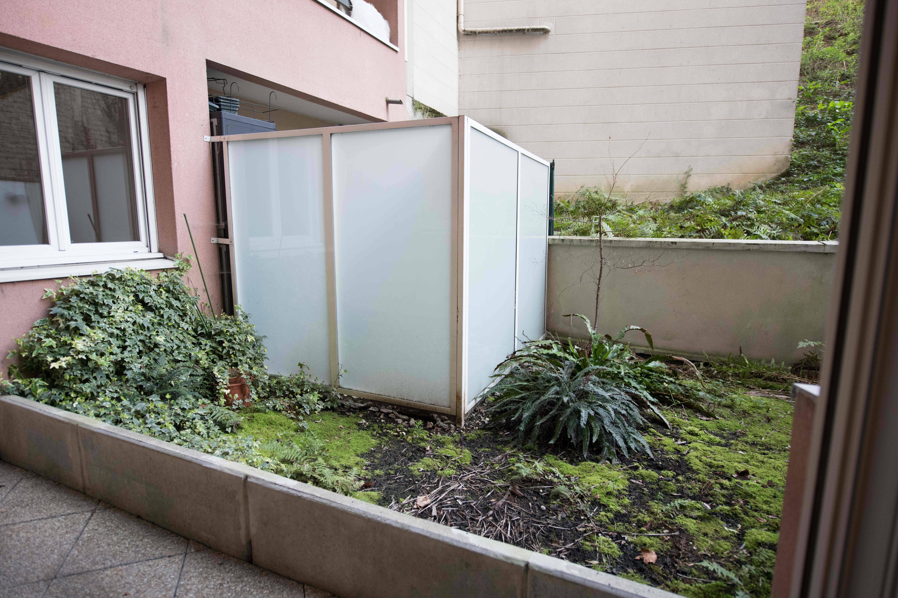
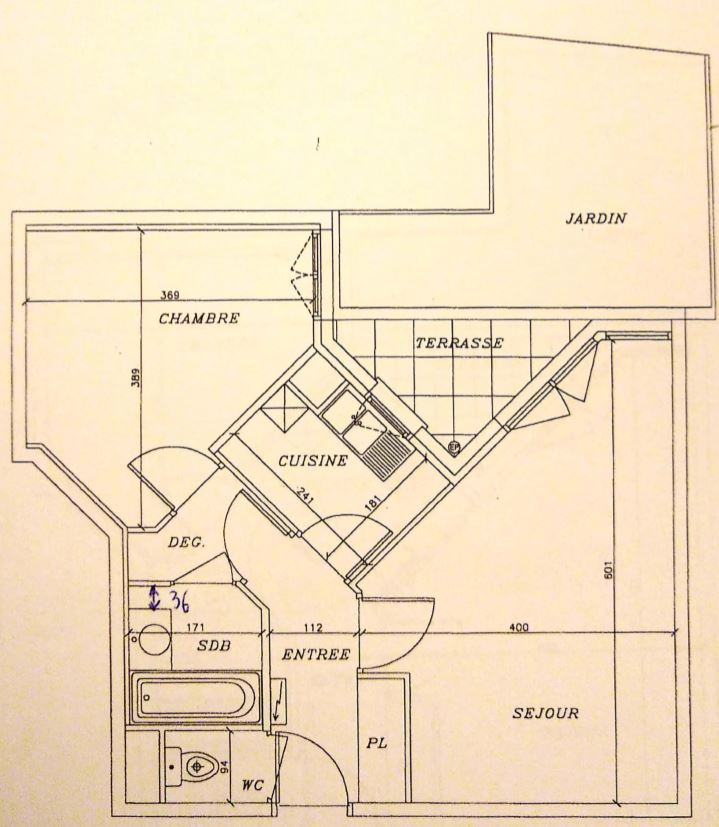
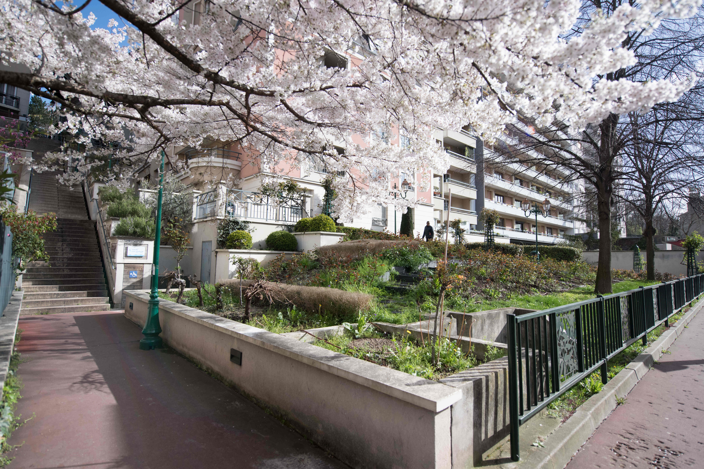

# Appartement 2 pièces 45 m2 Montgolfier extérieur 15 m2, parking

300 000 euros

## Descriptif

Quartier Montgolfier à Saint-Maurice.

À moins de 5 minutes commerce (Franprix, Carrefour market, boulangeries, ...), marché de Joinville (jeudi, dimanche), transport, écoles, crèches.
Proximité du bois de Vincennes, des bords de Marne.

L'appartement comprends :
- un salon de 18 m2 donnant sur un extérieur privatif (15 m2)
- une chambre avec rangements 12 m2
- une cuisine séparée (pouvant être ouverte)
- une salle de bain
- un WC séparé
- une entrée avec rangements
- une place de parking, accès par ascenseur.

L'appartement se situe dans une résidence de 2003 au rez-de-jardin, sans vis-à-vis au calme. Bon standing, parquet massif. La résidence comprend 52 copropriétaires, elle est bien entretenue, pas de travaux votés.
chauffage gaz individuel. fibre optique installée.

## Charges

charges de copro annuelles : 950 euros (contrat de maintenance chaudière inclu)
impôts fonciers 2019 : 1000 euros

## Transport

RER Joinville-Le-Pont (10min à pied)

bus 111 (au pied de l'immeuble)   
 * déssert  au sud : Champigny - St-Maur RER / St-Maur - Créteil RER   
 * déssert au nord : Charenton école (ligne Métro 8) / Porte de Charenton (tram 3a) / Bercy (ligne Metro 14)
 
bus 281 (au pied de l'immeuble), déssert Joinville-Le-Pont RER / Créteil - Prefecture Metro / Créteil Europarc

## Contact

Premier contact par email à fabien.nicol@gmail.com, précisez brièvement votre projet, votre financement.
Comptes rendus d'AG et relevés des charges fournis après visite.

Agence s'abstenir.

## Photos

*la couleur du carrelage est en fait sable.*

